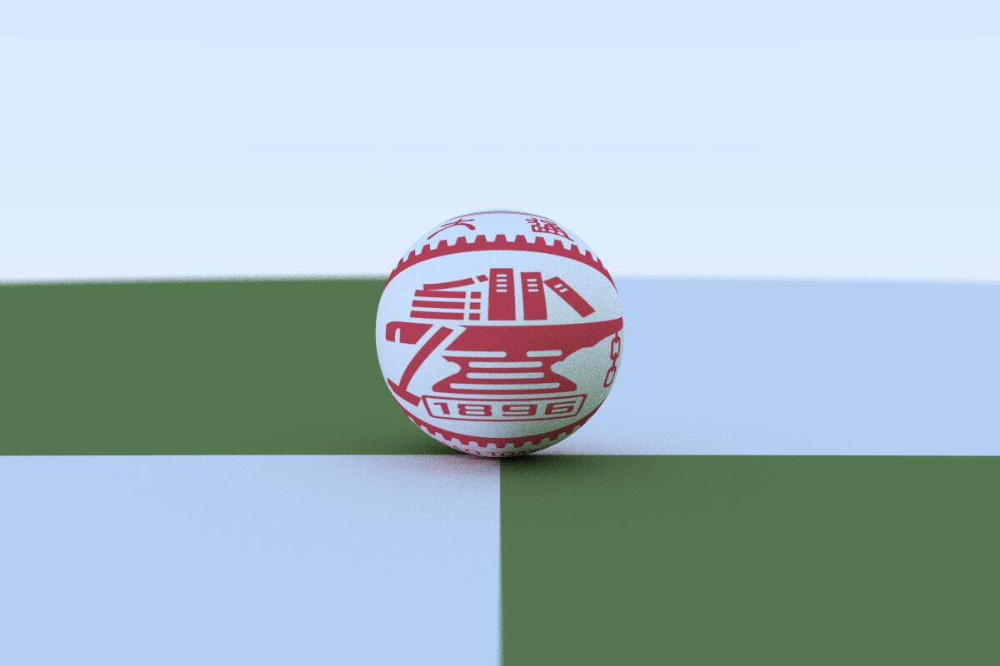
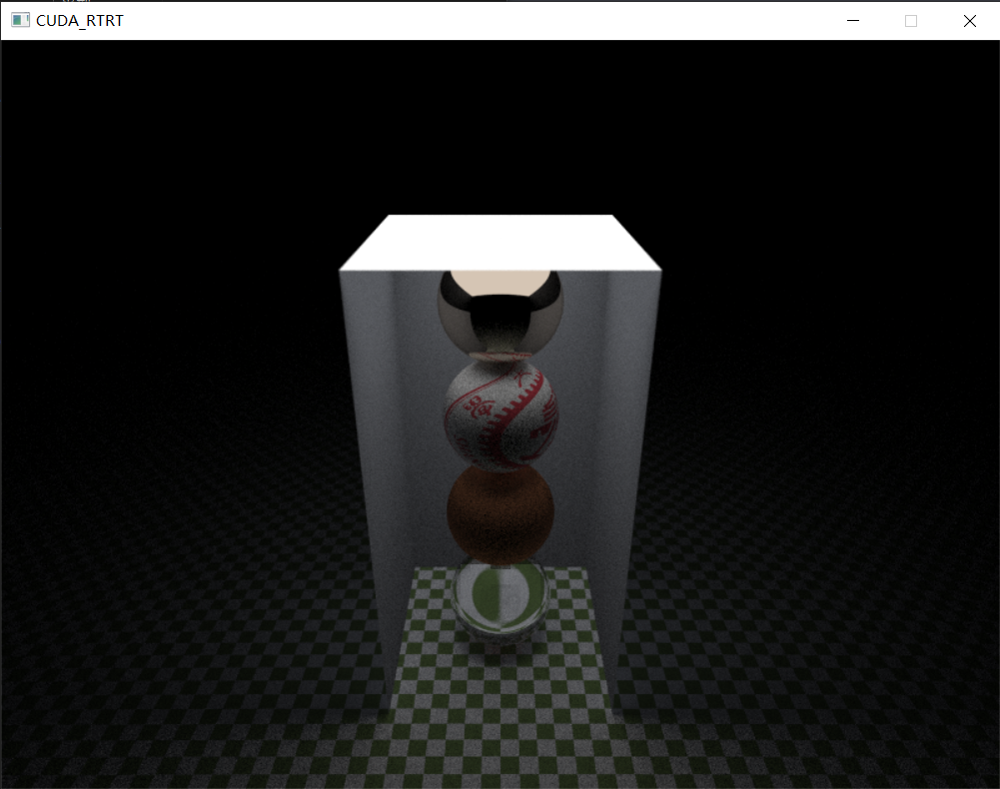

# CUDA_RayTracer

This simple ray tracer is based on [Ray Tracing in One Weekend](https://raytracing.github.io/books/RayTracingInOneWeekend.html) and [Ray Tracing: The Next Week](https://raytracing.github.io/books/RayTracingTheNextWeek.html). To push the ray tracer to CUDA for GPU accelerating, I referred to [Accelerated Ray Tracing in One Weekend in CUDA](https://developer.nvidia.com/blog/accelerated-ray-tracing-cuda/).

------

## Environment

- System: Windows 10
- GPU: RTX 2060 Max-Q
- NVIDIA-SMI 512.78
- Driver Version: 512.78
- [CUDA Version: 11.6](https://developer.nvidia.com/cuda-11-6-0-download-archive)
- [Visual Studio 2022 Community](https://visualstudio.microsoft.com/zh-hans/thank-you-downloading-visual-studio/?sku=Community&channel=Release&version=VS2022&source=VSLandingPage&passive=false&cid=2030)
- Image Utilities: [stb](https://github.com/nothings/stb)

------

## How to build

0. [How to setup CUDA with Visual Studio(Chinese)](https://zhuanlan.zhihu.com/p/488518526)
1. Copy all source code into a CUDA project.
2. [Build with Visual Studio](https://www.youtube.com/watch?v=WqzZ_YDQnw8)

------

## Basic Version

In the folder "Basic_Version", you can build a naïve ray tracer output .ppm image.

## Advance Version

In the folder "Advance_Version", you can build a naïve ray tracer with GUI and real time rendering (very low fps though). You may need to set the GUI support following this video [GPU Raytracer in C++ Part 2: Render to a window](https://www.youtube.com/watch?v=H3DsNoz2osw "GPU Raytracer in C++ Part 2: Render to a window"). In order to accelerate, I have modified *qbImage.cpp* and *qbImage.h*, so be careful they are not completely the same as the original version from [QuantitativeBytes/qbRayTrace2/qbRayTrace](https://github.com/QuantitativeBytes/qbRayTrace2/tree/main/qbRayTrace).

22/12/9 update: I have added diffuse light material(in *material.h*) and rectangle hittable shape(in *aarect.h*). The output result can be as below:

Also I have tried **skybox** method to show the scenery of our campus in SJTU. The output result can be as below:

----

## TODO

- [x] AABB accelerating structure

- [x] diffuse light material

- [x] rectangle shape

- [ ] .obj support

- [ ] ...
  
  (Too much wanna do, too naïve to implement  /(ㄒoㄒ)/~~)