This repository is a simple ray tracer based on [Ray Tracing in One Weekend](https://raytracing.github.io/books/RayTracingInOneWeekend.html) and [Ray Tracing: The Next Week](https://raytracing.github.io/books/RayTracingTheNextWeek.html). To utilize CUDA for GPU accelerating, I referred to [Accelerated Ray Tracing in One Weekend in CUDA](https://developer.nvidia.com/blog/accelerated-ray-tracing-cuda/).

------
## Environment
- System: Windows 10
- GPU: RTX 2060 Max-Q
- NVIDIA-SMI 512.78
- Driver Version: 512.78
- [CUDA Version: 11.6](https://developer.nvidia.com/cuda-11-6-0-download-archive)
- [Visual Studio 2022 Community](https://visualstudio.microsoft.com/zh-hans/thank-you-downloading-visual-studio/?sku=Community&channel=Release&version=VS2022&source=VSLandingPage&passive=false&cid=2030)
- Image Utilities: [stb](https://github.com/nothings/stb)
- Media Utilities: [SDL2](https://www.libsdl.org/)
## Install
1. In order to configure CUDA programming environment, you can refer to this article: [CUDA开发环境搭建](https://zhuanlan.zhihu.com/p/488518526).
2. Create a new project with CUDA template in Visual Studio.
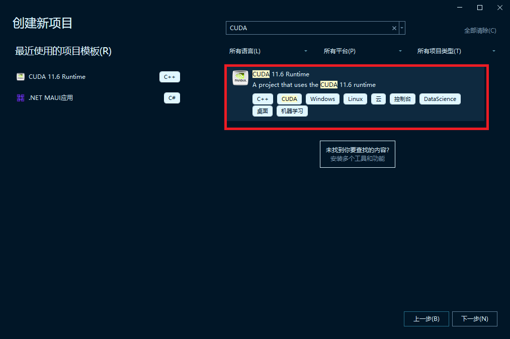
3. Copy code at `src` to the project (include code in `src/stb` and `src/SDL2`).
4. Set the path to SDL2's `include` and `lib/x64`.
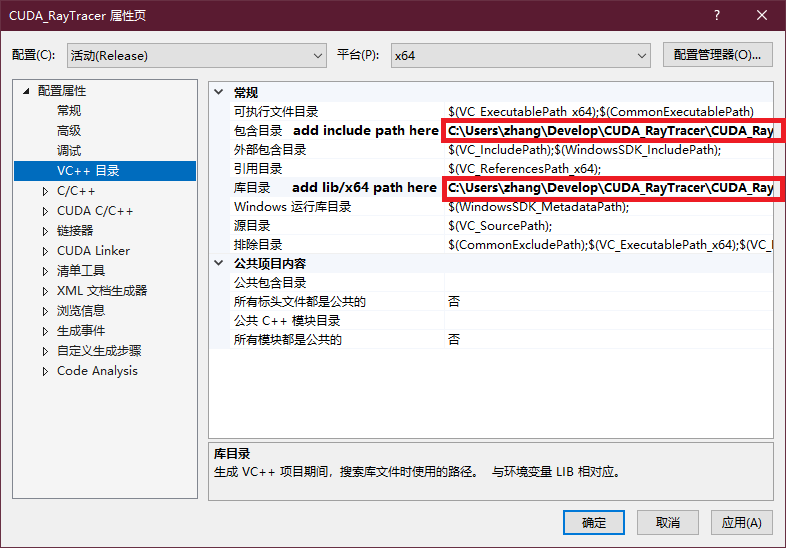
5. Set the path to SDL2's `.lib/x64` files.
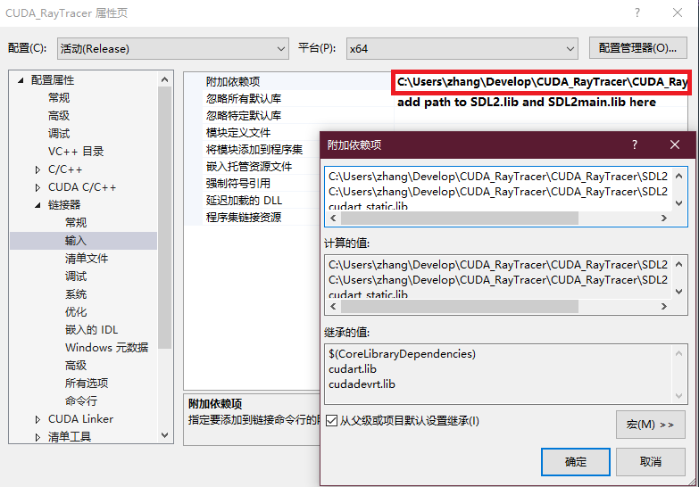
6. Build with Visual Studio.
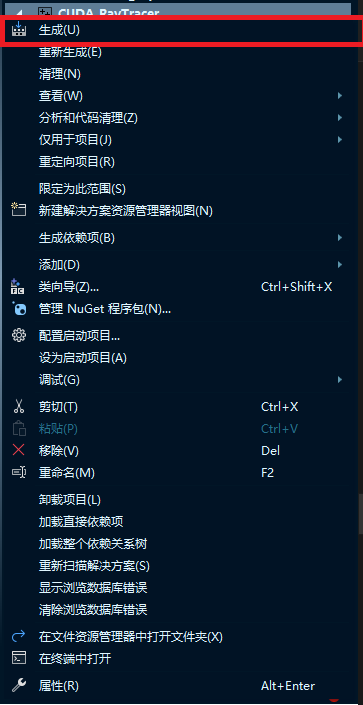
7. Copy the `SDL2.dll` to the release file.
8. Your are ready to run.
## Results
In the folder "Advance_Version", you can build a naïve ray tracer with GUI and real time rendering (very low fps though). You may need to set the GUI support following this video [GPU Raytracer in C++ Part 2: Render to a window](https://www.youtube.com/watch?v=H3DsNoz2osw "GPU Raytracer in C++ Part 2: Render to a window"). In order to accelerate, I have modified *qbImage.cpp* and *qbImage.h*, so be careful they are not completely the same as the original version from [QuantitativeBytes/qbRayTrace2/qbRayTrace](https://github.com/QuantitativeBytes/qbRayTrace2/tree/main/qbRayTrace).

I have implemented scenes as below:
1. Scene of SJTU:
   1.
    ```
    $ .\CUDA_RayTracer.exe
    Which scene do you want to generate?(0-7):0
    How many samples for 1 pixel do you want?(4-1024):512
    Which view do you want to see?(0-2):0
   ```
      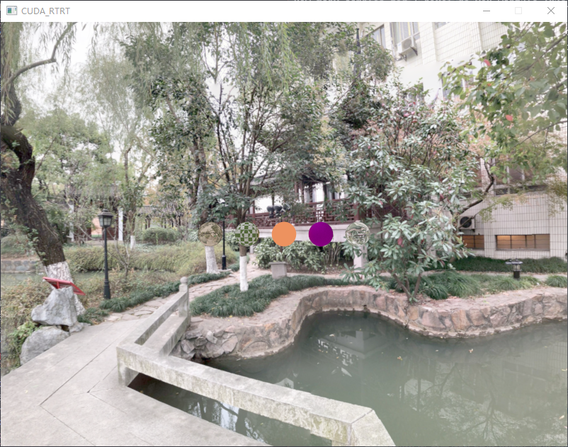
   2. 
    ```
    $ .\CUDA_RayTracer.exe
    Which scene do you want to generate?(0-7):0
    How many samples for 1 pixel do you want?(4-1024):512
    Which view do you want to see?(0-2):1
   ```
      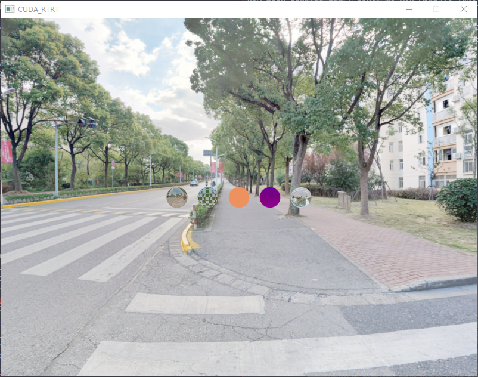
   3. 
    ```
    $ .\CUDA_RayTracer.exe
    Which scene do you want to generate?(0-7):0
    How many samples for 1 pixel do you want?(4-1024):512
    Which view do you want to see?(0-2):2
   ```
      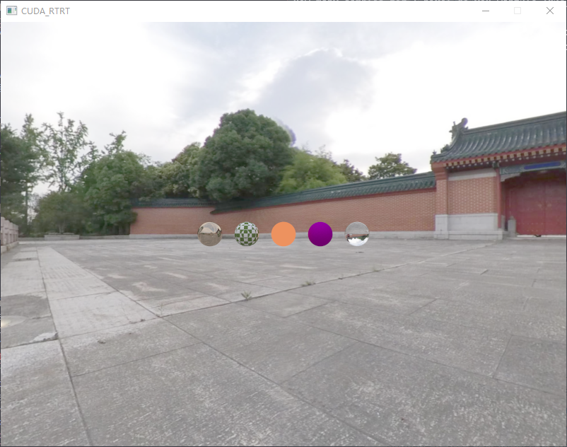
2. Scene of balls with different materials:
   1. 
    ```
     $ .\CUDA_RayTracer.exe
     Which scene do you want to generate?(0-7):1
     How many samples for 1 pixel do you want?(4-1024):512
    ```
      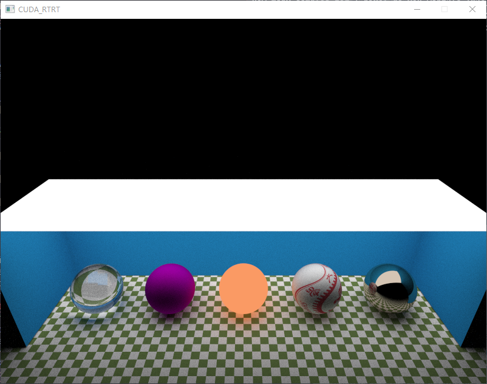
   2. 
    ```
    $ .\CUDA_RayTracer.exe
    Which scene do you want to generate?(0-7):2
    How many samples for 1 pixel do you want?(4-1024):512
    ```
      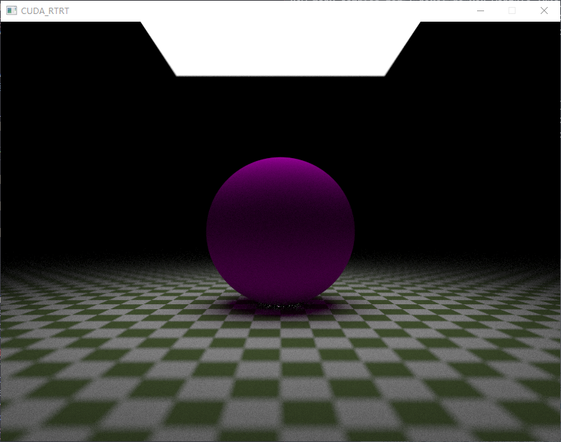
   3. 
    ```
    $ .\CUDA_RayTracer.exe
    Which scene do you want to generate?(0-7):3
    How many samples for 1 pixel do you want?(4-1024):512
    ```
      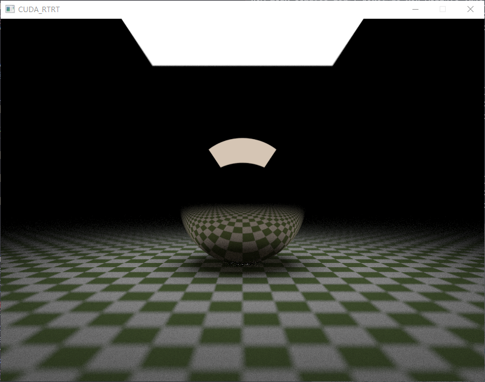
   4. 
    ```
    $ .\CUDA_RayTracer.exe
    Which scene do you want to generate?(0-7):4
    How many samples for 1 pixel do you want?(4-1024):512
    ```
      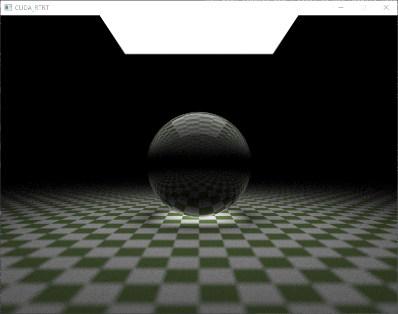
   5. 
    ```
    $ .\CUDA_RayTracer.exe
    Which scene do you want to generate?(0-7):5
    How many samples for 1 pixel do you want?(4-1024):512
    ```
      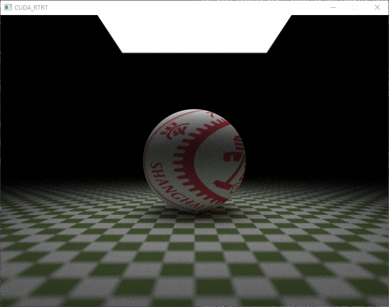
   6. 
    ```
    $ .\CUDA_RayTracer.exe
    Which scene do you want to generate?(0-7):6
    How many samples for 1 pixel do you want?(4-1024):512
    ```
      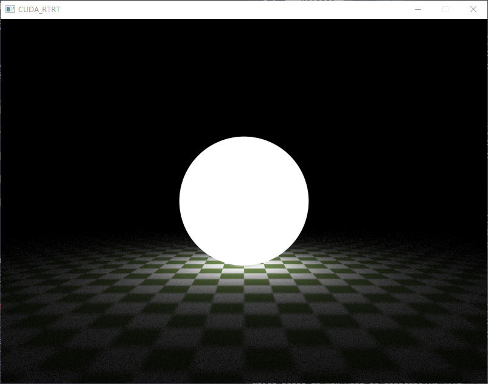
3. Scene of a box:
    ```
    $ .\CUDA_RayTracer.exe
    Which scene do you want to generate?(0-7):7
    How many samples for 1 pixel do you want?(4-1024):512
    ```
   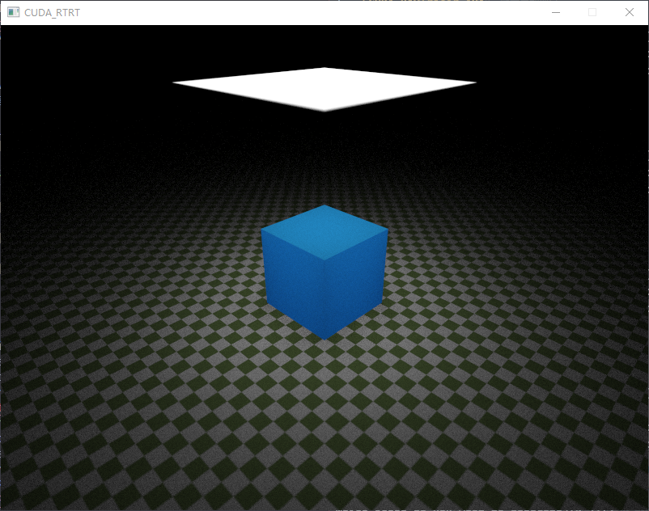
## Interaction
<video id="video" controls="" preload="none">
  <source id="mp4" src="pic/interaction.mp4" type="video/mp4">
</videos>